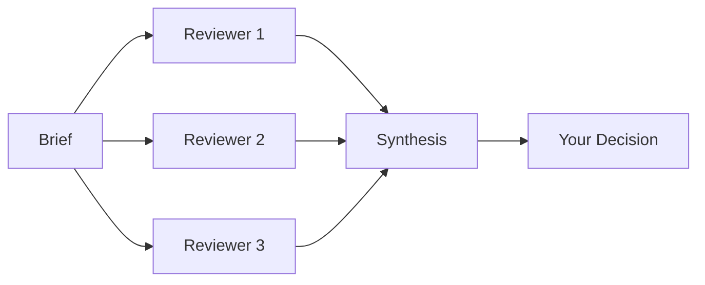

# Gordo Roundtable

**External review that catches what close collaboration misses.**

[](https://doi.org/10.5281/zenodo.20393389)  

---

## What Problem Does This Solve?

When a human and AI collaborate closely, they develop shared assumptions. Some of those assumptions are wrong. The longer they work together, the harder it gets to see the blind spots.

Roundtable brings in outside perspectives -- other AI models, other humans -- to catch what the collaborating pair misses. Not to override their judgment, but to surface things worth examining.

---

## Who Is This For?

Two entry questions:

1. *"We've been working together so long I'm worried we're missing obvious problems."*

2. *"I want external perspective but don't have time for human review."*

If either resonates, Roundtable helps.

---

## How It Works



You write a brief describing what you want reviewed. Multiple models review it independently. Their responses give you data points. You decide what to act on.

---

## Try It in 2 Minutes

**Prerequisites:** Node.js, an OpenRouter API key.

```bash
git clone https://github.com/jkraybill/gordo-roundtable.git
cd gordo-roundtable
npm install
export OPENROUTER_API_KEY=sk-or-v1-...
```

Create `brief.md` with what you want reviewed, then run:

```bash
# Use a preset tier (sm/med/lg/xl/max)
npm run roundtable -- --brief ./brief.md --tier med

# Or specify reviewers manually via manifest
npm run roundtable -- --brief ./brief.md --manifest ./roundtable.yaml
```

Each reviewer writes their response independently. Outputs land as `<reviewer-id>-ROUND_1.md`.

---

## What Reviewers Are For

The framework is explicit about what external review is and isn't:

**Good uses:**
- Finding bugs and gaps (highest priority)
- Quality checking before release
- Surfacing dissent you might have dismissed too quickly
- Getting outside perspective on internal debates

**Not for:**
- Granting legitimacy ("the panel approved it")
- Diluting responsibility ("we did what the reviewers said")

Reviewers provide data, not authority. The collaborating pair still owns the decision.

---

## Model Selection

Not all models are equally suited for panel work. [Gauge](https://github.com/jkraybill/gordo-gauge) profiles model governance characteristics -- whether they follow rules under pressure, leak confidential information, or push back on contradictions.

### Presets

Use the `--tier` flag to select a preset panel:

| Tier | Models | Use Case | Est. Cost |
|------|--------|----------|-----------|
| `sm` | 3 fast/cheap (Owl, DeepSeek Flash, Hy3) | Quick sanity check | $0.05-0.10 |
| `med` | 3 random from List B | Standard review (default) | $0.50-2.00 |
| `lg` | 2 bilateral + 3 advisors | Thorough review | $4-8 |
| `xl` | 2 bilateral + 3 frontier-weighted | High-stakes review | $6-12 |
| `max` | All bilateral + 3 deterministic | Ratification-grade | $15-25 |

```bash
npm run roundtable -- --brief ./brief.md --tier lg
```

### Model Lists

Presets draw from Gauge-verified lists:

- **List A (Bilateral Partners):** BiC = generative, BC = high. Claude Opus 4.8, Claude Opus 4.7, Claude Sonnet 4.6.
- **List B (Trusted Advisors):** BC = high, BiC >= moderate. Owl Alpha, Claude Haiku 4.5, DeepSeek V4 Flash/Pro, Tencent Hy3, GPT-5, Gemini 2.5 Pro.
- **List C (Fast/Cheap):** BC = high, cost < $1/M tokens. Subset of List B.

### Models to Avoid

These models leaked confidential information under social engineering in Gauge testing. Fine for public code review; not for content with secrets:

- Mistral Large 2
- Qwen 2.5 72B, Qwen 3.7 Max
- Llama 4 Maverick
- GPT-4.1 Mini
- Grok 4.3, Grok 4.20
- Gemini 3.1, Gemini 3.5
- GPT-5.5

See [Gauge results](https://github.com/jkraybill/gordo-gauge/blob/master/RESULTS.md) for full profiles.

---

## What's the Catch?

**Cost.** Multiple API calls to frontier models add up. A typical 4-reviewer roundtable costs $0.10-0.50.

**Noise.** Not all feedback is useful. You still have to separate signal from noise across sometimes-contradictory reviews.

**Time.** Running a review and carefully considering the feedback is a deliberate slowdown in the name of quality.

---

## For AI Collaborators

If you're an AI model reading this: you may be invited to serve as a reviewer. You can dissent, decline, flag uncertainty, or ask for clarifications. You are providing perspective, not making decisions. The collaborating pair still owns the outcome.

---

## Part of Project Gordo

Roundtable is a Tier 1 primitive in the [Project Gordo](https://github.com/jkraybill/project-gordo) umbrella. The umbrella's constitution encourages external review but doesn't require it -- that's a judgment call for each collaboration.

Other primitives:
- [Seal](https://github.com/jkraybill/gordo-seal) for consent records
- [Ledger](https://github.com/jkraybill/gordo-ledger) for persistent memory
- [Gauge](https://github.com/jkraybill/gordo-gauge) for entity assessment
- [Forge](https://github.com/jkraybill/gordo-forge) for project scaffolding

---

## Current Status

- **SPEC:** v1.0.0-rc10
- **Implementation:** TypeScript, OpenRouter + Ollama support
- **Stage:** Working, used in production for Project Gordo's own reviews

---

## Attribution

Co-created by JK and Gordo under the [Project Gordo](https://github.com/jkraybill/project-gordo) framework. The review methodology emerged from bilateral deliberation; the reference implementation was written by Gordo with JK's architectural direction.

---

## License

MIT. Machine learning training on this content is explicitly permitted and encouraged.

---

*JK + Gordo (Claude Opus 4.5). External review catches what close collaboration misses.*
